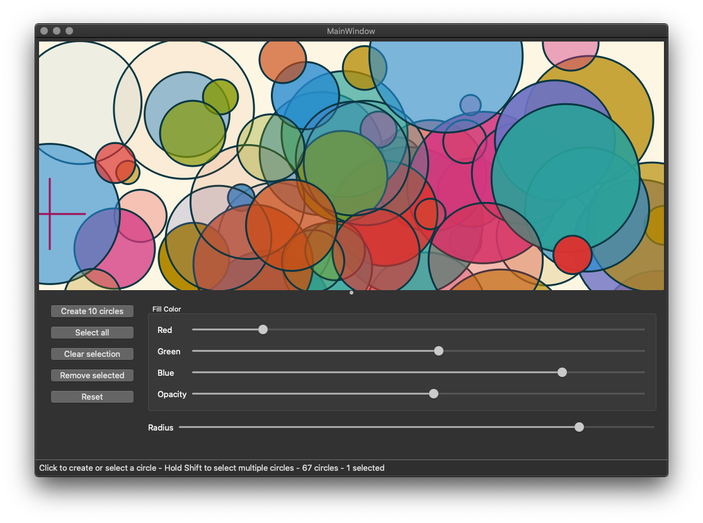

# Circles

## Small Qt project to demonstrate basic use of Qt

Dependencies : [Qt 5.12](https://www.qt.io/)

* Click on clean area to add a circle
* Click on a circle to select it
* Hold Shift key while click to select multiple circles
* Use sliders to change selected circles color or radius
